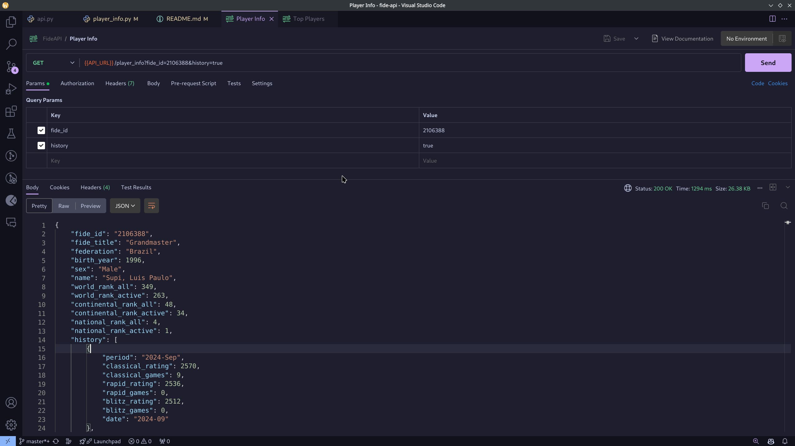

<h1 align="center">
  FIDE API
</h1>

<h4 align="center">Python FIDE scraper and HTTP API</h4>

<p align="center">
  <a href="#about">About</a> •
  <a href="#features">Features</a> •
  <a href="#usage">Usage</a> •
  <a href="#credits">Credits</a> •
  <a href="#license">License</a>
</p>



## About

Working with FIDE official data is not simple, mainly because they don't have an API. That's the reason I made a simple API with FastAPI to scrape the data from their own website and provide it as JSON over HTTP requests.

A Redis cache is implemented to provide faster lookups for common use cases. Additionally, the API now includes MongoDB integration for storing and querying FIDE and CFC rating lists, with automatic periodic updates.

## Features

Check it on:
[https://fide-api.vercel.app/docs](https://fide-api.vercel.app/docs)

### FIDE Web Scraping
- Get top players list
- Get player info
- Get player history

### Rating List Database
- Query FIDE rating list data
- Query CFC rating list data
- Search for players by name
- Auto-updating rating lists

For detailed documentation, see:
- [Rating Lists Documentation](docs/rating_lists.md)
- [System Architecture](docs/system_architecture.md)
- [Monitoring Guide](docs/monitoring_guide.md)

## Usage

### Docker (recommended)

You will need docker and docker-compose installed, from your terminal:

```sh
git clone https://github.com/cassiofb-dev/fide-api

cd fide-api

docker compose up -d

# Initialize rating lists (this may take some time on first run)
docker exec fide-api /app/initialize_rating_lists.sh

# Start the updater service for automatic updates
docker exec -d fide-api /app/start_updater_service.sh
```

### Native

You will need git and python installed, from your terminal:

```sh
git clone https://github.com/cassiofb-dev/fide-api

cd fide-api

python -m venv venv

source venv/bin/activate

pip install -r requirements.txt

# Start MongoDB (required for rating list features)
# Make sure you have MongoDB installed or running via Docker

# Initialize rating lists (optional)
python initialize_rating_lists.sh

# Start the API server
uvicorn src.api:app --reload
```

To see the docs go to ``localhost:8000/docs``

## Deployment

### Docker Deployment to Linux Server

This project is configured for easy deployment to any Linux server using Docker:

1. **Automated Deployment with GitHub Actions**:
   - The repository includes a GitHub Actions workflow file for CI/CD
   - Each push to the main branch triggers an automatic build and deployment
   - See `.github/workflows/docker-publish.yml` for workflow details

2. **Manual Deployment**:
   - Use the included `deploy.sh` script:
   ```sh
   ./deploy.sh
   ```
   - This pulls the latest code, builds the Docker image, and restarts all services

3. **Docker Compose Setup**:
   - The `docker-compose.yml` includes:
     - FIDE API service
     - Redis for caching
     - MongoDB for rating list storage

   - Alternative (with MongoDB Atlas): 
   - The `mongo-docker-compose.yml` includes
      - FIDE API service
      - Redis for caching
   
   For deployments involving MongoDB, ensure that the MONGO_URI is set correctly. 

4. **Maintenance Commands**:
   - Reset the MongoDB database: `docker exec fide-api python reset_mongodb.py`
   - Check logs: `docker logs fide-api`
   - View MongoDB data: `docker exec -it mongodb mongosh fide_api`
   - Check system health: `curl http://localhost:8000/health`

5. **Monitoring**:
   - The API includes a `/health` endpoint for system monitoring
   - Docker health checks are configured for all containers
   - See [docs/monitoring_guide.md](docs/monitoring_guide.md) for comprehensive monitoring instructions

### Update Schedule

- **FIDE Rating List**: Updates monthly (typical release on the 1st of each month)
- **CFC Rating List**: Updates weekly

## API Endpoints

### Original FIDE API Endpoints
- `GET /top_players/` - Get a list of top FIDE players
- `GET /player_history/` - Get a player's rating history
- `GET /player_info/` - Get detailed player information

### Rating List API Endpoints
- `GET /ratinglist/fide/{player_id}` - Get a FIDE player's rating data
- `GET /ratinglist/cfc/{player_id}` - Get a CFC player's rating data
- `GET /ratinglist/fide/top` - Get top rated FIDE players
- `GET /ratinglist/cfc/top` - Get top rated CFC players
- `GET /ratinglist/search` - Search for players by name
- `GET /ratinglist/metadata` - Get rating list metadata
- `POST /ratinglist/update` - Trigger manual update of rating lists
- `POST /ratinglist/reset` - Reset rating lists database
- `GET /health` - Check API and service health status

## Rating List Data Sources

- FIDE Rating List: Downloaded from `https://ratings.fide.com/download/standard_rating_list_xml.zip`
- CFC Rating List: Downloaded from `https://storage.googleapis.com/cfc-public/data/tdlist.txt`

## Environment Variables

| Variable | Description | Default |
| --- | --- | --- |
| `REDIS_HOST` | Redis server host | `localhost` |
| `REDIS_PORT` | Redis server port | `6379` |
| `CACHE_EXPIRY` | Cache expiration time in seconds | `3600` |
| `MONGO_URI` | MongoDB connection URI | `mongodb://localhost:27017/` |
| `MONGO_DB` | MongoDB database name | `fide_api` |
| `FIDE_DOWNLOAD_URL` | URL to download FIDE rating list | `https://ratings.fide.com/download/standard_rating_list_xml.zip` |
| `CFC_DOWNLOAD_URL` | URL to download CFC rating list | `https://storage.googleapis.com/cfc-public/data/tdlist.txt` |

## Credits

This project uses git, python, Redis, and MongoDB.

The following key python dependencies are used:
```txt
annotated-types==0.7.0
anyio==4.6.0
beautifulsoup4==4.12.3
fastapi==0.115.0
orjson==3.10.7
pandas==2.2.1
pymongo==4.6.1
pydantic==2.9.2
redis==6.0.0
requests==2.32.3
schedule==1.2.1
uvicorn==0.31.0
xmltodict==0.13.0
```

## License

MIT

---
