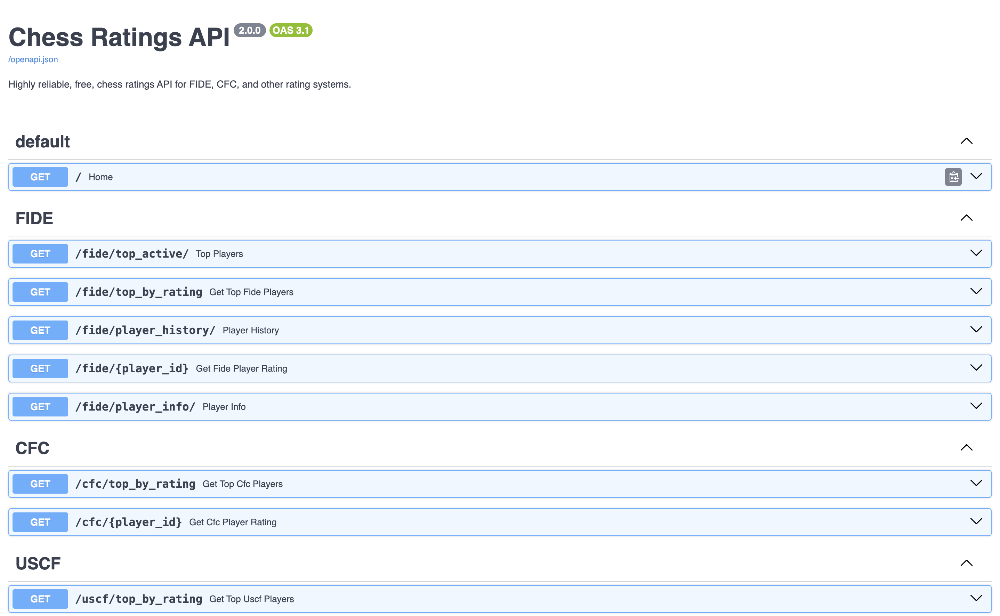
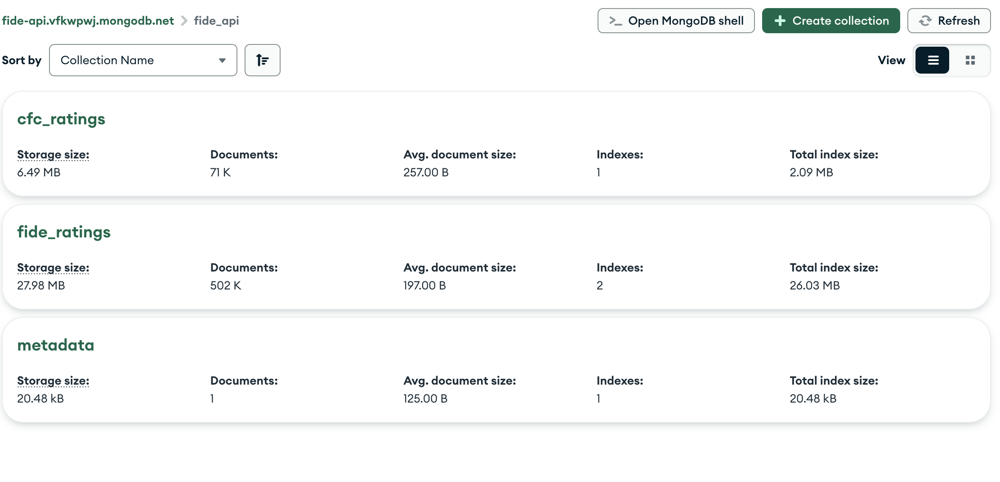

<h1 align="center">
  Chess Ratings API
</h1>

<h4 align="center">Python FIDE scraper for FIDE Ratings, CFC Ratings, and USCF ratings available in a web-based format</h4>

<p align="center">
  <a href="#about">About</a> •
  <a href="#features">Features</a> •
  <a href="#usage">Usage</a> •
  <a href="#credits">Credits</a> •
  <a href="#license">License</a>
</p>



## About

Working with FIDE official data is not simple, mainly because they don't have an API. That's the reason I made a simple API with FastAPI to scrape the data from their own website and provide it as JSON over HTTP requests.

Similarly, no publicly available API is currently available for CFC ratings. We aim to change that with this project.

A Redis cache is implemented to provide faster lookups for common use cases. Additionally, the API now includes MongoDB integration for storing and querying FIDE, CFC, and USCF rating lists, with automatic periodic updates. 

A MongoDB server is used for storing the latest FIDE, CFC, and USCF ratings. 

## Features

Check it on:
[https://ratings.chesstools.org](https://ratings.chesstools.org)

### FIDE Web Scraping
- Get top active players list
- Get detailed player information
- Get player rating history

### Rating List Database
- Query FIDE rating list data
- Query CFC rating list data
- Query USCF rating list data
- Search for players by name
- View top-rated players
- Health monitoring

For detailed documentation, see:
- [Rating Lists Documentation](docs/rating_lists.md)
- [System Architecture](docs/system_architecture.md)
- [Monitoring Guide](docs/monitoring_guide.md)

## Usage

### Docker (recommended)

You will need docker and docker-compose installed, from your terminal:

```sh
git clone https://github.com/Hart-House-Chess-Club/ratings-api

cd fide-api

docker compose up -d

# Initialize rating lists (this may take some time on first run)
docker exec fide-api /app/initialize_rating_lists.sh

# Start the updater service for automatic updates
docker exec -d fide-api /app/start_updater_service.sh
```

### Native

You will need git and python installed, from your terminal:

```sh
git clone https://github.com/Hart-House-Chess-Club/ratings-api

cd fide-api

python -m venv venv

source venv/bin/activate

pip install -r requirements.txt

# Start MongoDB (required for rating list features)
# Make sure you have MongoDB installed or running via Docker

# Initialize rating lists (optional)
./initialize_rating_lists.sh

# Start the API server
uvicorn src.api:app --reload
```

To see the docs go to ``localhost:8000/docs``

## Deployment

### Docker Deployment to Linux Server

This project is configured for easy deployment to any Linux server using Docker:

1. **Automated Deployment with GitHub Actions**:
   - The repository includes a GitHub Actions workflow file for CI/CD
   - Each push to the main branch triggers an automatic build and deployment
   - See `.github/workflows/docker-publish.yml` for workflow details

2. **Manual Deployment**:
   - Use the included `deploy.sh` script:
   ```sh
   ./deploy.sh
   ```
   - This pulls the latest code, builds the Docker image, and restarts all services

3. **Docker Compose Setup**:
   - The `docker-compose.yml` includes:
     - FIDE API service
     - Redis for caching
     - MongoDB for rating list storage

   - Alternative (with MongoDB Atlas): 
   - The `mongo-docker-compose.yml` includes:
      - Cloud-based MongoDB
   
   For deployments involving MongoDB Atlas, ensure that the MONGO_URI is set correctly:
   - Create a `.env` file in the same directory as your docker-compose file with:
     ```
     MONGO_TOKEN=your_mongodb_connection_string
     ```
   - Or set it in your environment before running docker compose:
     ```sh
     export MONGO_TOKEN=your_mongodb_connection_string
     docker compose -f mongo-docker-compose.yml up -d --build
     ```

The MongoDB contains rating lists corresponding to respective ratings files such as cfc_ratings for CFC ratings.



4. **Maintenance Commands**:
   - Reset the MongoDB database: `docker exec fide-api python reset_mongodb.py`
   - Check logs: `docker logs fide-api`
   - View MongoDB data: `docker exec -it mongodb mongosh fide_api`
   - Check system health: `curl http://localhost:8000/health`

5. **Monitoring**:
   - The API includes a `/health` endpoint for system monitoring
   - Docker health checks are configured for all containers
   - See [docs/monitoring_guide.md](docs/monitoring_guide.md) for comprehensive monitoring instructions

### Update Schedule

- **FIDE Rating List**: Updates monthly (typical release on the 1st of each month)
- **CFC Rating List**: Updates weekly

## API Endpoints

### FIDE API Endpoints
- `GET /fide/top_active/` - Get a list of top active FIDE players
- `GET /fide/top_by_rating` - Get top rated FIDE players from the database
- `GET /fide/player_history/` - Get a player's rating history
- `GET /fide/player_info/` - Get detailed player information
- `GET /fide/{player_id}` - Get a FIDE player's rating data from the database

### CFC API Endpoints
- `GET /cfc/top_by_rating` - Get top rated CFC players from the database
- `GET /cfc/{player_id}` - Get a CFC player's rating data from the database

### USCF API Endpoints
- `GET /uscf/top_by_rating` - Get top rated USCF players from the database
- `GET /uscf/{player_id}` - Get a USCF player's rating data from the database

### General Endpoints
- `GET /ratinglist/search` - Search for players by name in either FIDE or CFC rating lists
- `GET /ratinglist/metadata` - Get rating list metadata
- `GET /health` - Check API and service health status

## Rating List Data Sources

- FIDE Rating List: Downloaded from `https://ratings.fide.com/download/standard_rating_list_xml.zip`
- CFC Rating List: Downloaded from `https://storage.googleapis.com/cfc-public/data/tdlist.txt`
- USCF Rating List: Downloaded from `https://www.kingregistration.com/combineddb`

## Environment Variables

| Variable | Description | Default |
| --- | --- | --- |
| `REDIS_HOST` | Redis server host | `localhost` |
| `REDIS_PORT` | Redis server port | `6379` |
| `CACHE_EXPIRY` | Cache expiration time in seconds | `3600` |
| `MONGO_URI` | MongoDB connection URI | `mongodb://localhost:27017` |
| `MONGO_DB` | MongoDB database name | `fide_api` |

## Credits

Original FIDE-API available from: [fide-api](https://github.com/cassiofb-dev/fide-api/)

## License

MIT

